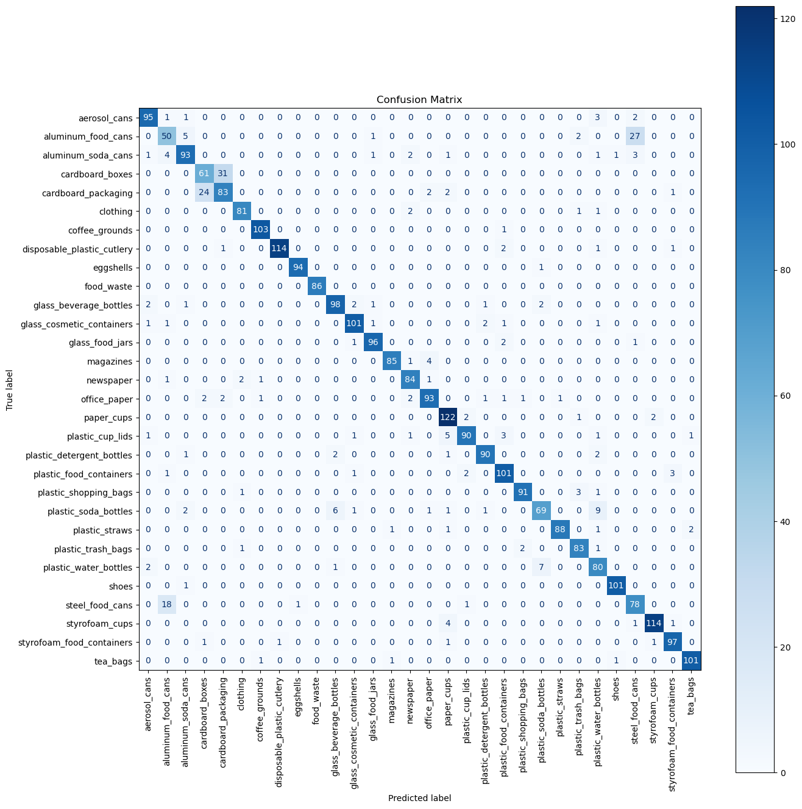

# SmartSort-Trash-Image-Classifier

_Automated Segregation of Waste Images Into 30 Categories_

## Overview

This project demonstrates **image classification** for trash segregation, leveraging deep learning to recognize and sort images of waste into 30 distinct classes. It aims to aid recycling and waste management efforts by automating the sorting process.

- **Dataset:** [Recyclable and Household Waste Classification (Kaggle)][1]
- **Code:** Jupyter notebook (`trash-classification.ipynb`) included.
- **Task:** Classifying images as one of 30 waste categories.

## Dataset

The project uses this publicly available dataset:
- [Recyclable and Household Waste Classification on Kaggle][1]
- The dataset includes various trash types, such as:
  - Glass containers
  - Plastic bags
  - Aluminum cans
  - Office paper
  - Clothing
  - Food containers
  - ...and many more

## Project Structure

- `trash-classification.ipynb`: Main notebook containing all the code, training, validation, and evaluation.
- Images directory: Sample images for each trash class.

## Usage

1. Clone this repository or download the Jupyter notebook.
2. Download the dataset from [Kaggle][1] and set up the directory structure accordingly.
3. Run the notebook:
   - Data loading & preprocessing
   - Model training
   - Evaluation

## Results and Evaluation

Model performance metrics are evaluated at the end of the notebook.
Overall Accuracy `~91%`

### Confusion Matrix

### Classification Report

The classification report below provides details on **precision, recall, f1-score** and **support** for each class:

| Class | Precision | Recall | F1-Score | Support |
|-------|-----------|--------|----------|---------|
| 0     | 0.93      | 0.93   | 0.93     | 102     |
| 1     | 0.66      | 0.59   | 0.62     | 85      |
| 2     | 0.89      | 0.87   | 0.88     | 107     |
| 3     | 0.69      | 0.66   | 0.68     | 92      |
| 4     | 0.71      | 0.74   | 0.72     | 112     |
| 5     | 0.95      | 0.95   | 0.95     | 85      |
| 6     | 0.97      | 0.99   | 0.98     | 104     |
| 7     | 0.99      | 0.96   | 0.97     | 119     |
| 8     | 0.99      | 0.99   | 0.99     | 95      |
| 9     | 1.00      | 1.00   | 1.00     | 86      |
| 10    | 0.92      | 0.92   | 0.92     | 107     |
| 11    | 0.94      | 0.94   | 0.94     | 108     |
| 12    | 0.96      | 0.96   | 0.96     | 100     |
| 13    | 0.98      | 0.94   | 0.96     | 90      |
| 14    | 0.91      | 0.94   | 0.93     | 89      |
| 15    | 0.92      | 0.89   | 0.91     | 104     |
| 16    | 0.88      | 0.96   | 0.92     | 127     |
| 17    | 0.95      | 0.87   | 0.91     | 103     |
| 18    | 0.95      | 0.94   | 0.94     | 96      |
| 19    | 0.91      | 0.94   | 0.92     | 108     |
| 20    | 0.97      | 0.95   | 0.96     | 96      |
| 21    | 0.87      | 0.77   | 0.82     | 90      |
| 22    | 0.99      | 0.95   | 0.97     | 93      |
| 23    | 0.92      | 0.95   | 0.94     | 87      |
| 24    | 0.78      | 0.89   | 0.83     | 90      |
| 25    | 0.98      | 0.99   | 0.99     | 102     |
| 26    | 0.70      | 0.80   | 0.74     | 98      |
| 27    | 0.97      | 0.95   | 0.96     | 120     |
| 28    | 0.94      | 0.96   | 0.95     | 101     |
| 29    | 0.97      | 0.97   | 0.97     | 104     |
|       |           |        |          |         |
| **Accuracy**    |           |        | **0.91** | 3000    |
| **Macro Avg**   | 0.91      | 0.91   | 0.91     | 3000    |
| **Weighted Avg**| 0.91      | 0.91   | 0.91     | 3000    |

**Overall Accuracy:** 0.9073  
**Overall Precision:** 0.9071  
**Overall Recall:** 0.9052  
**Overall F1 Score:** 0.9055  

